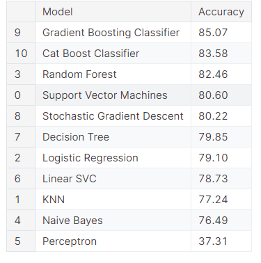

A Brief Overview of Titanic Data Analysis
By: Eva M Lopez
What is the graphs.ipynb file?
This file was meant to explore any correlation within the titanic data that would be interesting to further explore.More survivors were found in first class. The less passengers payed the more survivors there were.The higher the passenger class the more passengers payed. More females survived. There are various graphs, but these are the highlights of information.
What is the model_practice.ipynb file?
The idea of this file was to find a model that would best fit the titanic data. It was also to find the model with the best accuracy for predictions (machine learning).
Models used:
Logistic Regression model:
Accuracy: 0.7567567567567568
Random Forest Classifier:
Accuracy: 0.6486486486486487
Support Vector Classifier:
Accuracy: 0.6756756756756757
AdaBoostClassifier:
Accuracy: 0.8108108108108109
Bagging Classifier:
Accuracy: 0.7027027027027027
Vote Classifier:
Accuracy: 0.7297297297297297
Gradient Boosting Algorithm:
Accuracy: 0.7837837837837838
Extreme Gradient Boosting Algorithm:
Accuracy: 0.7297297297297297
AdaBoostClassifier held the highest accuracy. Grid search was not included.
Grid Search: Used to fine-tune a range that would result in the best accuracy.
Was it good?
The accuracies proved to stay in the 64-81 range of percentages. Normally the best accuracy would be as close to 95% as possible, but that did not appear here. According to online sources:
 for example (https://www.kaggle.com/code/kalvainhindi/titanic-achieved-with-85-07-accuracy)
the result of this data analysis is expected. 